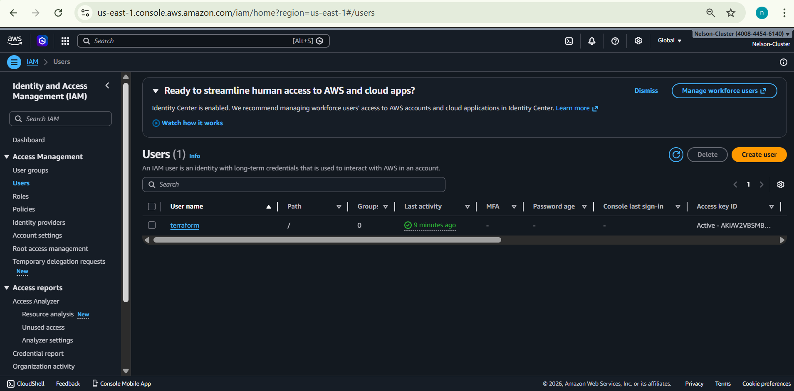
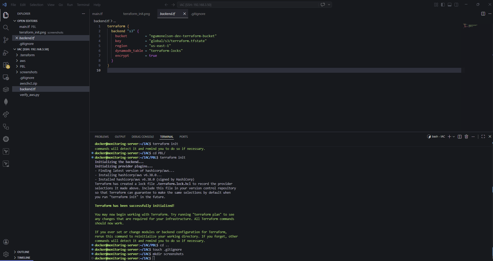
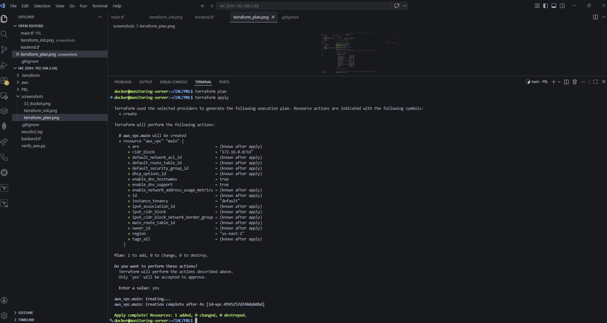
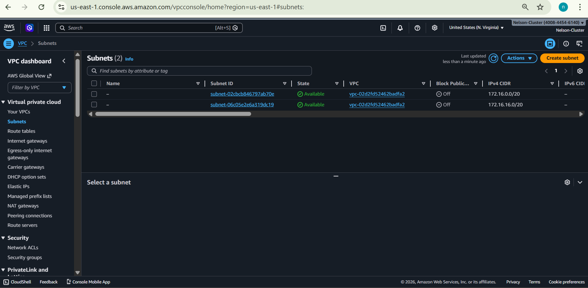
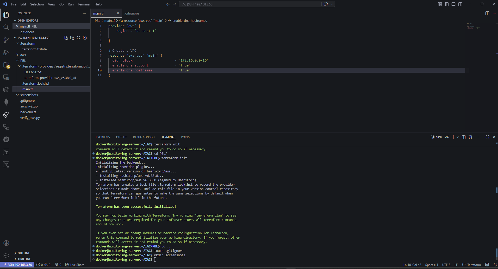
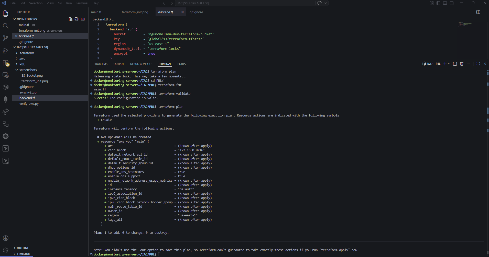
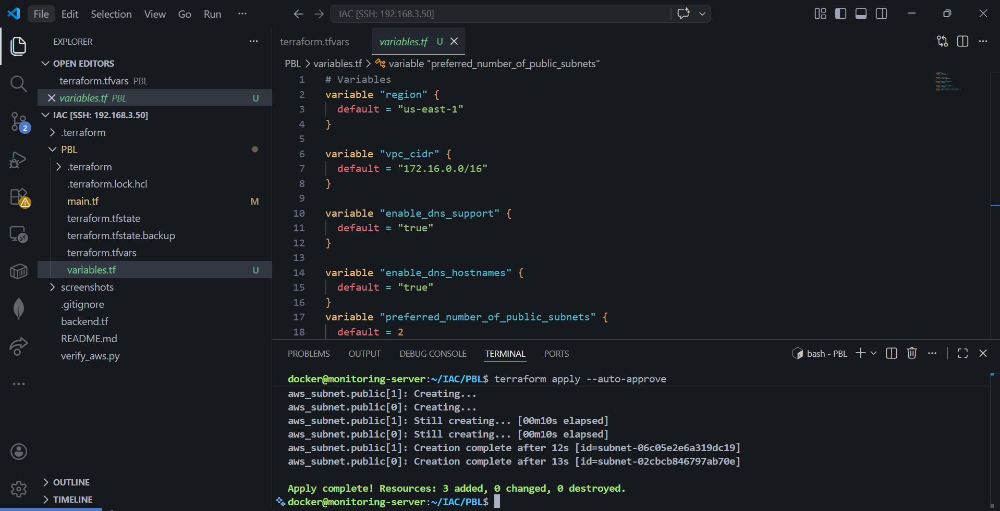

# AWS Infrastructure as Code (IaC) with Terraform

This repository contains Terraform configurations for provisioning AWS infrastructure as part of the StegHub DevOps & Cloud Accelerator Programme.

---

## Prerequisites

- AWS CLI v2
- Terraform >= 1.0
- Python 3.6+
- boto3
- Git

---

## Project Structure
```
IAC/
├── PBL/
│   ├── main.tf          # Main Terraform configuration
│   └── backend.tf       # S3 remote backend configuration
├── screenshots/         # Project screenshots
├── .gitignore
└── README.md
```

---

## Setup & Configuration

### 1. AWS CLI Configuration
Configure AWS CLI with your credentials:
```bash
aws configure
```

### 2. Verify AWS Access
```bash
aws sts get-caller-identity
```
<!-- Screenshot: AWS identity verification -->


### 3. S3 Backend Bucket
Created S3 bucket for Terraform remote state:
```bash
aws s3api create-bucket \
    --bucket ngumonelson-dev-terraform-bucket \
    --region us-east-1
```
<!-- Screenshot: S3 Bucket -->


---

## Infrastructure Provisioned

### VPC
- CIDR Block: `172.16.0.0/16`
- DNS Support: Enabled
- DNS Hostnames: Enabled

<!-- Screenshot: VPC -->


### Public Subnets
- 2 public subnets across different availability zones
- Auto-assigned public IPs on launch
- AZs dynamically fetched using `aws_availability_zones` data source

| Subnet | CIDR | AZ |
|--------|------|----|
| public-0 | 172.16.0.0/24 | us-east-1a |
| public-1 | 172.16.1.0/24 | us-east-1b |

<!-- Screenshot: Subnets -->


---

## Terraform Commands
```bash
# Initialize Terraform
terraform init

# Preview changes
terraform plan

# Apply changes
terraform apply -auto-approve

# Destroy infrastructure
terraform destroy -auto-approve
```

---

## Screenshots

| Step | Screenshot |
|------|------------|
| Terraform Init |  |
| Terraform Plan |  |
| VPC Created |  |
| S3 Bucket |  |

---

## Author

**Nelson Ngumo**  
ICT Officer | DevOps & Cloud Engineer  
StegHub DevOps & Cloud Accelerator Programme